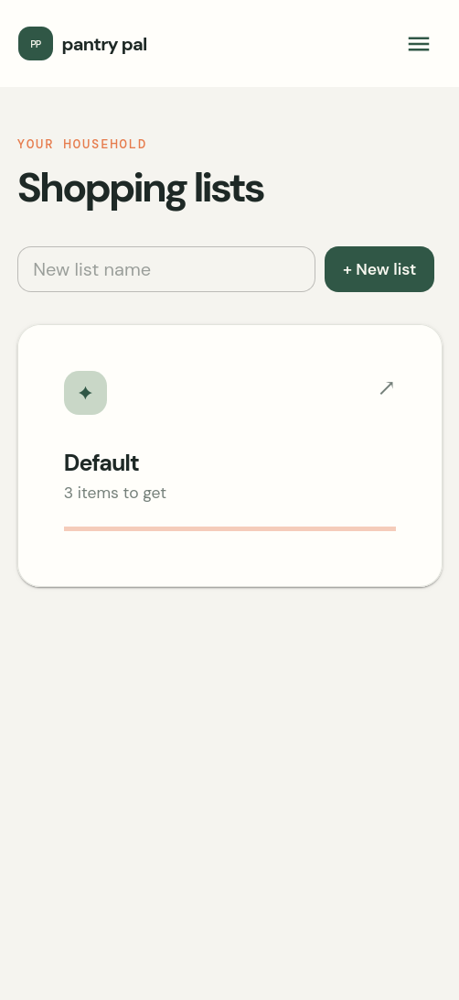
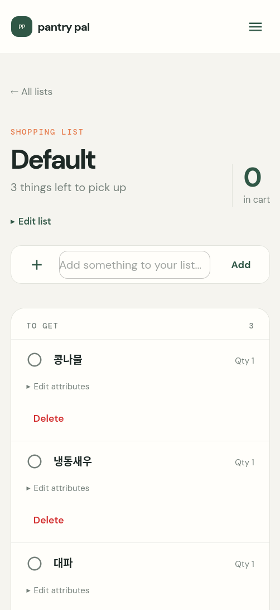
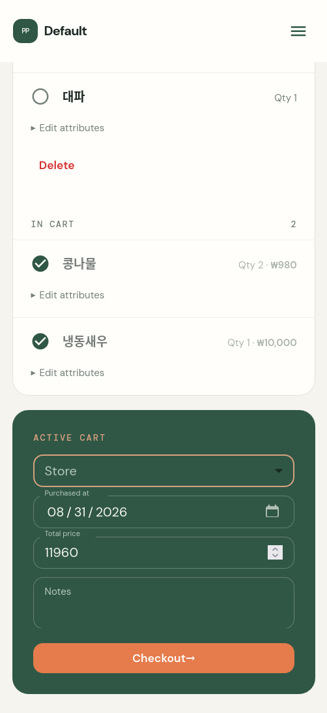

# Pantry Pal

Pantry Pal is an online-first, installable grocery and pantry companion for mobile and desktop web. It lets authenticated users share shopping lists, reuse master items, track cart contents, and keep purchase history for future reference.

## Screenshots

### Shopping lists



### Shopping list items



### Active cart



## Product documents

- [Product requirements](docs/product-requirements.md)
- [Architecture and data model](docs/architecture.md)
- [GitOps handoff](docs/gitops-handoff.md)

## Initial technical direction

- Next.js App Router for the web UI and backend routes
- PostgreSQL for application data
- Prisma for schema and migrations
- Generic OIDC authentication, configurable for Keycloak or Amazon Cognito
- English UI, `Asia/Seoul` timezone, and `KRW` currency by default
- One container image used by both the web runtime and a migration job
- Separate Python print worker using Pillow and `python-escpos` for networked Xprinter receipts
- No Kubernetes or GitOps manifests in this repository

## Local PostgreSQL

Start the database only:

```bash
docker compose -f docker-compose.postgres.yml up -d
cp .env.example .env
npm run db:migrate
```

Stop the database while preserving its data:

```bash
docker compose -f docker-compose.postgres.yml down
```

To remove the local database volume as well, run `docker compose -f docker-compose.postgres.yml down -v`.

The application requires authentication before any shopping-list or purchase data can be accessed. Offline editing is out of scope for the initial release.

## Local development with Kubernetes OpenTelemetry

To send local server and client error telemetry to the Collector running in Kubernetes:

```bash
npm run dev:otel
```

The helper forwards the `otel-collector` Service in the `pantry` namespace from local port `4318`, sets `OTEL_EXPORTER_OTLP_ENDPOINT` to `http://127.0.0.1:4318`, and starts Next.js. The port-forward is stopped automatically when development ends.

Override the Kubernetes target when needed:

```bash
OTEL_NAMESPACE=observability OTEL_SERVICE=otel-collector npm run dev:otel
```

## Receipt printing

Checkout publishes a print job to RabbitMQ. The separate print worker fetches
the receipt data, renders Hangul and prices to a PNG using the bundled Korean
font, adds a QR code linking to the authenticated receipt detail page, and
prints it through the Xprinter's raw ESC/POS network port.

Install the Python worker dependencies in a virtual environment:

```bash
pip install -r requirements-print.txt
```

Set `XPRINTER_HOST` and `XPRINTER_PORT` (normally `9100`) in `.env`, then run:

```bash
npm run worker:print
```

To test a real purchase without RabbitMQ, fetch its receipt, display the text
preview, save the generated image under `/tmp`, and print it:

```bash
npm run printer:test -- \
  --purchase-id "<PURCHASE_ID>" \
  --host "<XPRINTER_IP>"
```

The test wrapper loads `.env` automatically. Set
`OTEL_EXPORTER_OTLP_ENDPOINT` and `OTEL_SERVICE_NAME` to export Python worker
spans through the OpenTelemetry collector.
